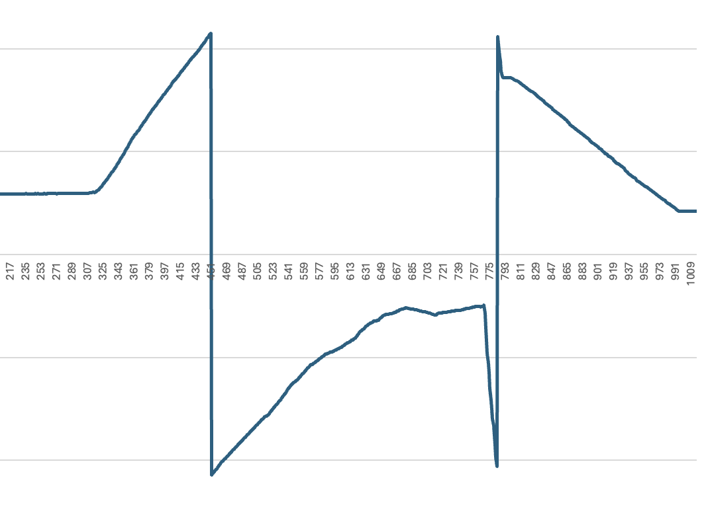

# fix-kestrel-overflow

Fix overflowing density altitude for the [Kestrel DROP D3](https://kestrelinstruments.com/data-loggers/kestrel-drop-d3-wireless-temperature-humidity-pressure-data-logger)

## So What's The Issue?

The density altitudes calculated by the device appear to overflow & wrap around somewhere near 10,600 feet, with no apparent discrepencies in any of the other measurements this value is derived from.

## Ok, What's The Fix?
### Offset
#### `offset`
...

### Recalculate
Recalculate the density altitude values using the other measured quantities. There are two calculations available:
#### `wet_air`
Calculate density altitude from the provided station parameters, assuming moistness.

See: https://www.weather.gov/media/epz/wxcalc/densityAltitude.pdf for more information

This approach appears to most closely match the Kestrel's internal density altitude calculation. Deltas between the two values appear to be on the order of 10-20 feet.

#### `dry_air`
Calculate density altitude from the provided station parameters, assuming dry air.

See: https://en.wikipedia.org/wiki/Density_altitude#Calculation for more information

Deltas between this calculation and the Kesterl's internal density altitude calculation have been on the order of 100-150 feet.

## CLI Interface
### `fixkestrel single`
Process a single Kestrel log file.
#### Input Parameters
| Parameter        | Description                    | Type         | Default     |
|------------------|--------------------------------|--------------|-------------|
| `--log-filepath` | Path to Kestrel log to parse.  | `Path\|None` | GUI Prompt  |
| `--fix-type`     | Log fixing method.1 | `str`        | `'wet_air'` |

### `fixkestrel batch`
Process a directory of Kestrel log file(s).
#### Input Parameters
| Parameter         | Description                                 | Type         | Default     |
|-------------------|---------------------------------------------|--------------|-------------|
| `--log-directory` | Path to Kestrel log directory to parse.     | `Path\|None` | GUI Prompt  |
| `--log-pattern`   | Log file glob pattern to match.2 | `str`        | `"*.csv"`   |
| `--fix-type`      | Log fixing method.1              | `str`        | `"wet_air"` |

1. See [Ok, What's The Fix](#ok-whats-the-fix) for valid fixing method specifications
2. Case file sensitivity is deferred to the host OS
